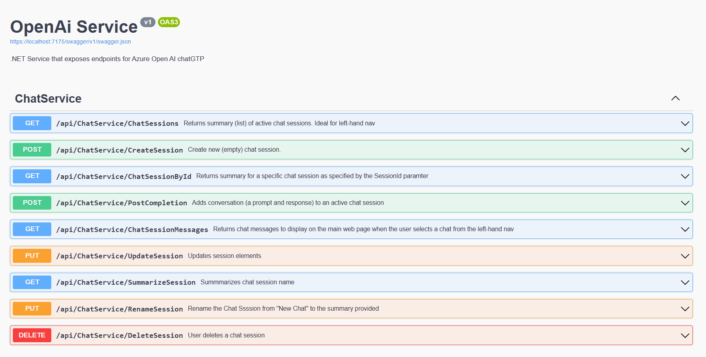
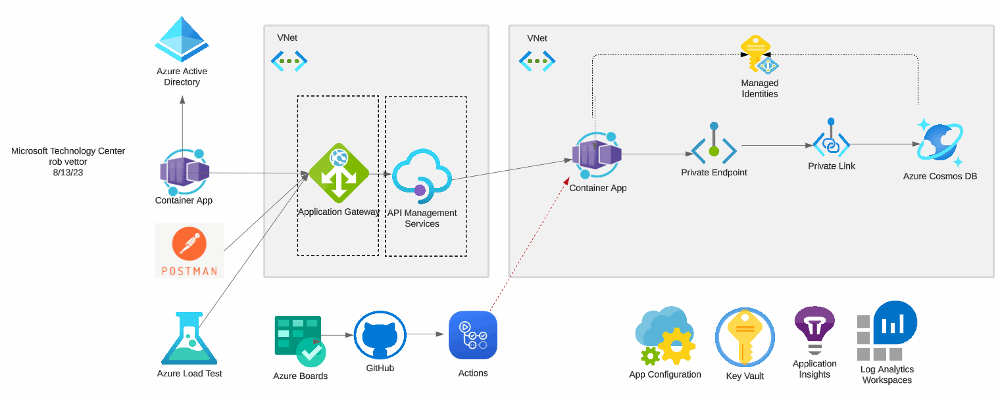

# Azure OpenAI Chat Microservice

### What it is...

A standalone microservice that can be plugged into most existing applications via a set of RESTful endpoints to enable OpenAI chat capabilties.

> Note: The service is derived from an earlier repo [cosmosdb-chatgrp](https://github.com/Azure-Samples/cosmosdb-chatgpt) which includes both a frontend and backend solution packaged as a single solution.

### What it does...

The service provides the required functionality to implement a chat-based experience leveraging Azure OpenAI SDK. 

The service is designed to be deployed as a container and can be scaled horizontally to meet demand.

### How it works...

The service exposes a set of RESTful endpoints that enable multiple chat sessions and the ability to add new chat sessions. Each chat session is associated with a unique chat session id. The service is stateless and does not maintain any state information. The service is designed to be deployed as a container and can be scaled horizontally to meet demand.:

The service is a RESTful API that exposes a set of endpoints that enable chat functionality.
A chat session consists of a 

### Implementation

The service can be deployed natively (as a .net assembly) or as a container. Current implementation includes:

 -  .net 7
 - Cosmos DB
 - Azure OpenAI SDK
 - Open API

### What's coming....

This repo starts with the backend and expands on it accordingly. Here is an architectural diagram:

Note that while the service is functional, there are addiiontal steps to complete the overall architecture.

|   ToDo Actions |
| --------------------------- |
| Re-engineer Cosmos DB data representation|
| Physically decouple data tier |
| Enable managed identities  |
| Enable App Configuration |
| Enable Key Vault    |
| Enable CI/CD pipelines with Actions    |
| Enable IaC with Bicep/Terraform    |
| Enable load testing with Azure Load Test  |
| Enable Azure B2C    |
| Enable CI/CD pipelines with Actions    |
| Consider adding AppGateway |

An accompanying repo for a Blazor-Server front-end app can be found at https://github.com/robvet/chatgpt-client.

**Requirements:**

- You will need an
  [Open AI API Key](https://openai.com/api/) or
  [Azure Open AI service key](https://learn.microsoft.com/azure/cognitive-services/openai/quickstart?pivots=rest-api)
  to get started.
- [Azure Functions Core Tools](https://learn.microsoft.com/azure/azure-functions/functions-run-local)
  are required to run the kernel as a local web service, used by the sample web apps.
- [.NET 7 SDK](https://dotnet.microsoft.com/download/dotnet/7.0)

## How to Contribute...

> Please contribute by
> opening GitHub [Issues](https://github.com/robvet/chatgtp-service/issues)

## Code of Conduct

This project has adopted the
[Microsoft Open Source Code of Conduct](https://opensource.microsoft.com/codeofconduct/).
For more information see the
[Code of Conduct FAQ](https://opensource.microsoft.com/codeofconduct/faq/)
or contact [opencode@microsoft.com](mailto:opencode@microsoft.com)
with any additional questions or comments.

## License